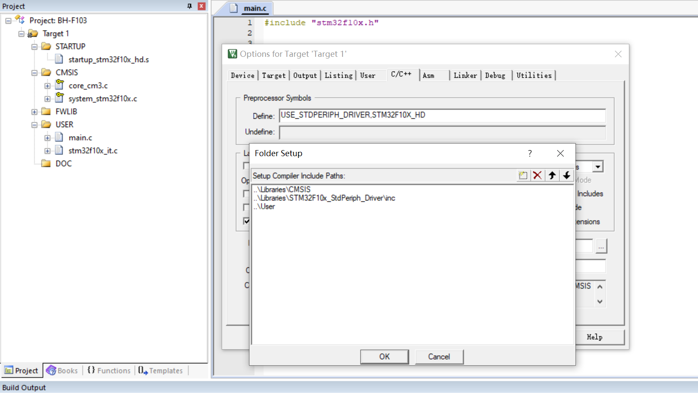
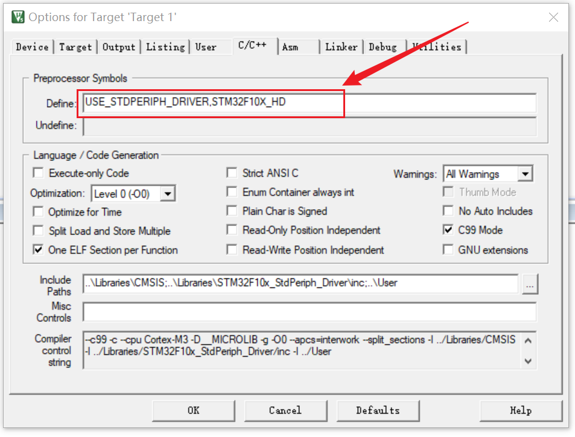
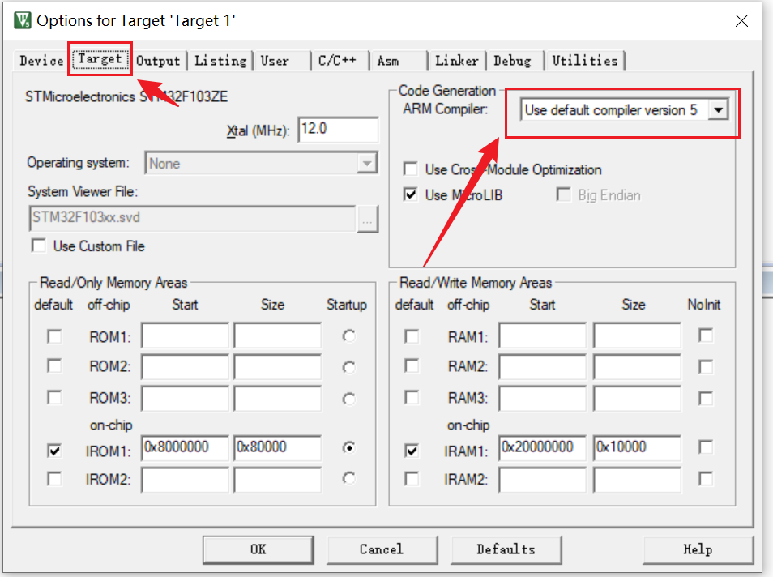

```text
1.安装kile5

2.新建工程  (参考day01)
    day01
        ├─Doc
        ├─Libraries
        │  ├─CMSIS
        │  │  └─startup
        │  └─STM32F10x_StdPeriph_Driver
        │      ├─inc
        │      └─src
        ├─Project
        │  ├─DebugConfig
        │  ├─Listings
        │  └─Objects
        └─User
            
3.添加c文件到组

```


```text
4.添加头文件
```


```text
5.定义 宏
```


```text
6.修改编译工具
```

