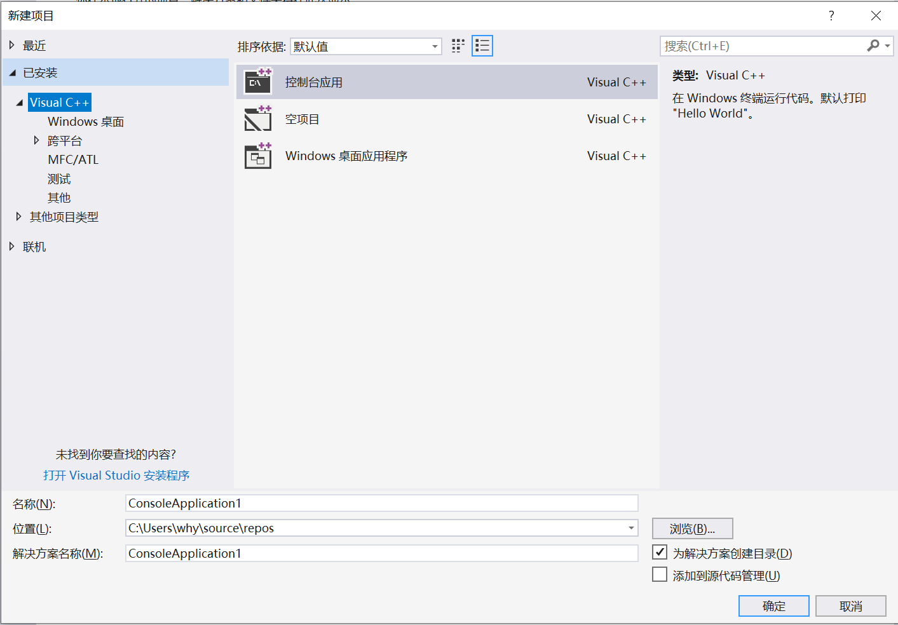
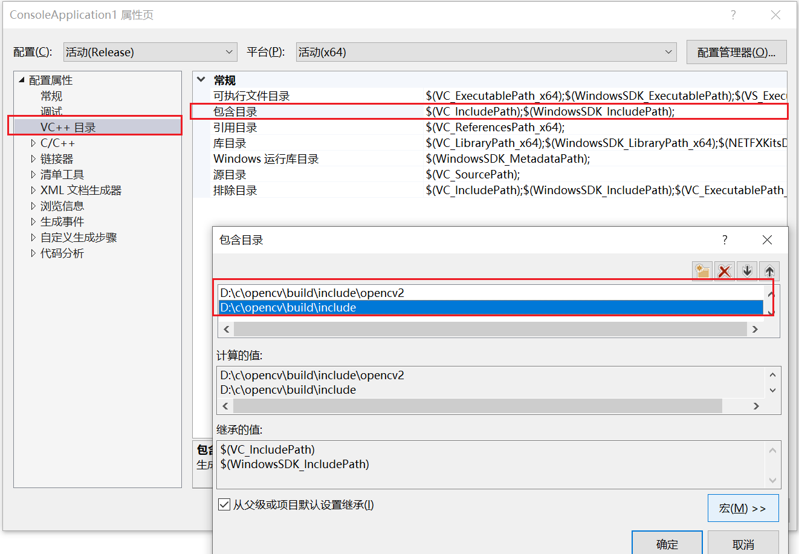

教程：
    https://docs.opencv.org/4.x/d3/d52/tutorial_windows_install.html

1. 下载安装包:

   https://sourceforge.net/projects/opencvlibrary/files/4.6.0/

    解压到 D:/c

   1. 配置环境变量

    OPENCV_DIR    D:\c\opencv\build\x64\vc15
    path          %OPENCV_DIR%\bin


2. 新建项目

    

3. 设置包含目录

   

4. 设置库目录

    

5. 配置连接器
   

6. 修配
   

7.编写代码
```c++

#include <opencv2/opencv.hpp>
#include <iostream>

using namespace cv;
using namespace std;

int main(int argc, char* argv[])
{
	Mat src = imread("D:/a.jpg");
	imshow("input", src);
	waitKey(0);
	destroyAllWindows();
	return 0;
}

```


