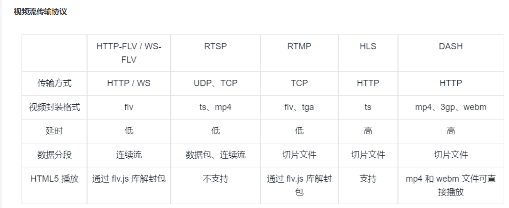

# 基础知识

```text
密器/文件
    指特定格式的多媒体文件： mp4/flv/mkv

媒体流
    
数据帧

编解码器

复用

解复用

=======================

码率

帧率


=======================     视频流协议

1. HTTP-FLV / WS-FLV
2. RTMP
3. HLS
4. RTSP
5. DASH


```

